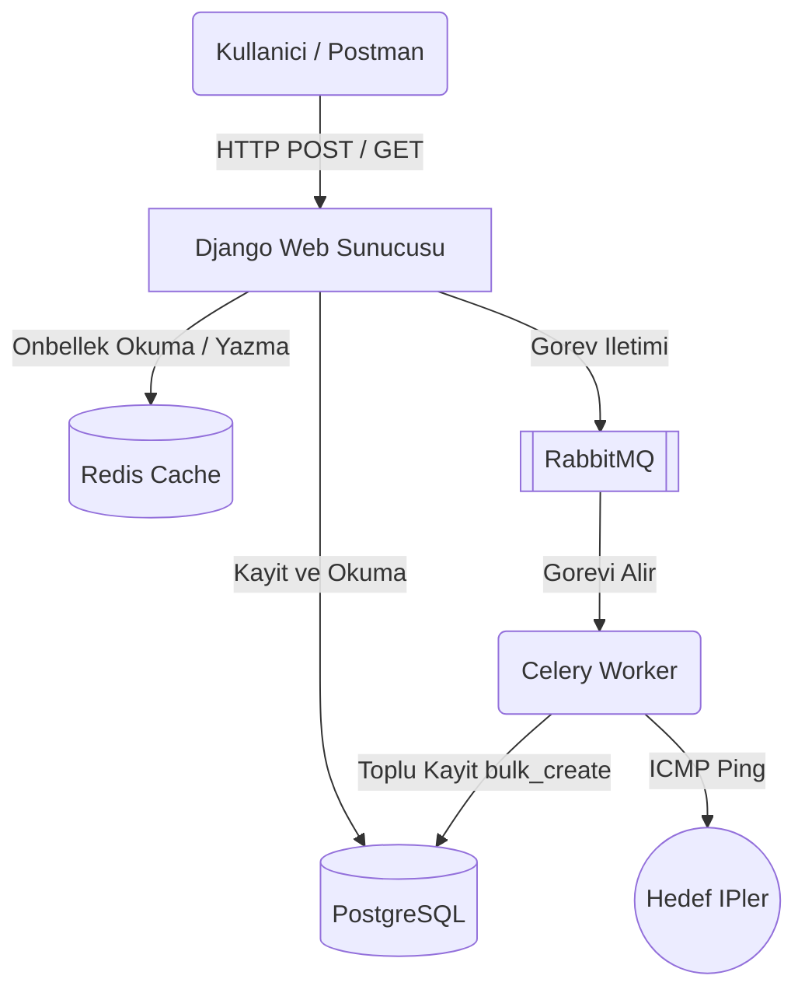
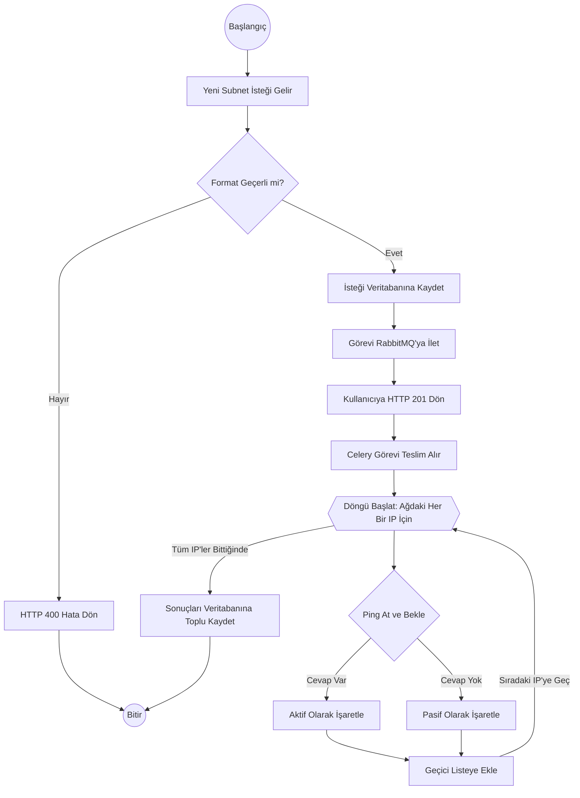

#  Asenkron Subnet Ping & Log API

Bu proje, kullanıcı tarafından girilen bir ağ adresindeki (Subnet) IP'lerin erişilebilirlik durumlarını (Ping) tespit etmek amacıyla geliştirilmiş microservice tabanlı bir REST API uygulamasıdır. 

Yüksek hacimli IP taramalarının sistemi kilitlemesini ve kullanıcıyı bekletmesini önlemek amacıyla **Celery** ile asenkron bir mimari tercih edilmiş; veritabanı yükünü hafifletmek için **Redis Cache** mekanizması entegre edilmiştir.

---

##  Kullanılan Teknolojiler
* **Backend:** Python 3.11, Django, Django REST Framework (DRF)
* **Asenkron İşleyici:** Celery
* **Mesaj Kuyruğu (Broker):** RabbitMQ
* **Önbellek (Cache):** Redis
* **Veritabanı:** PostgreSQL
* **Konteyner Orkestrasyonu:** Docker & Docker Compose

---

##  Kurulum ve Çalıştırma

Proje tamamen Dockerize edilmiştir. Bilgisayarınızda sadece **Docker** ve **Docker Compose** kurulu olması yeterlidir.

1. Proje dizinine gidin.
2. Terminalde aşağıdaki komutu çalıştırın:
   ```bash
   docker-compose up --build
3. Tüm servisler (Web, DB, Redis, RabbitMQ, Celery) ayağa kalktığında API kullanıma hazırdır.
    ```bash
    API Ana Adresi: http://localhost:8000/api/ping-requests/
   
##  API Kullanımı (Endpoints)
1. Yeni Bir Subnet Taraması Başlatmak (POST)

Endpoint: POST /api/ping-requests/

Kullanıcıdan gelen IP/Subnet formatı kontrol edilir. IPv4 için max /24, IPv6 için max /64 maske kısıtlaması vardır.
Geçerli ise işlem Celery kuyruğuna alınır ve anında cevap dönülür.

İstek (Request Body - JSON):
```bash
{
    "subnet": "8.8.8.0/29"
}
```


2. Tarama Sonuçlarını Görüntülemek (GET)
Endpoint: GET /api/ping-requests/<id>/

Celery arka planda işlemleri bitirdiğinde sonuçlar bu adresten çekilir.
Sonuçlar ilk okumadan sonra 5 dakikalığına Redis Cache üzerinde tutularak veritabanı maliyeti sıfıra indirilir.
# Topoloji

# Akış Algoritması


### Sonuçları Okuma (GET) ve Redis Cache Algoritması

```mermaid
flowchart TD
    Start((Başlangıç)) --> Req[Kullanıcı Sonuçları İster GET]
    Req --> Cache{Redis Önbelleğinde Kayıt Var mı?}
    Cache -->|Evet Var| RedisReturn[Veriyi RAM'den Hızlıca Al] --> Finish((Bitir))
    Cache -->|Hayır Yok| DB[Veriyi PostgreSQL'den Çek]
    DB --> SetCache[Çekilen Veriyi 5 Dakikalığına Redis'e Yaz]
    SetCache --> DBReturn[Kullanıcıya Dön] --> Finish